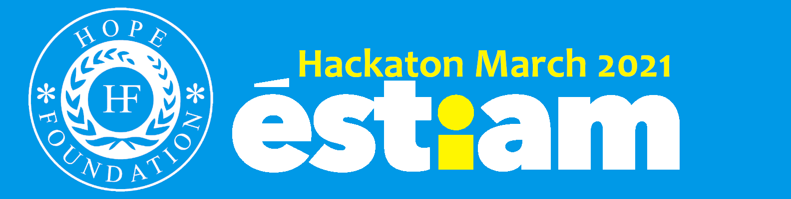

# hackathon-mars-2021
Projet Hackathon Mars 2021 de l'école ÉSTIAM. 

## There is our first Hackathon project of 2021.

We aiming to update the [Hope Foundation](https://www.hope-found.org/) website.
Our plan is to make this website cleaner and most of all to glow up.
Plus we are aiming to reach the SEO's and to reach the most of persons possibles with a lot of news widgets and tools.
We plan to help HF the most possible.

## About Hope Foundation

[Hope Foundation](https://www.hope-found.org/) is a German and Cameroonian non-profit and non-governmental organization. It was founded by a group of young, dynamic and committed individuals in 2001, with the primary goal of promoting community development and alleviating poverty in rural and impoverished areas of Cameroon. A number of awareness and cultural projects are also carried out within Germany.

## Contributors

| Contributors | profile link |
| ------ | ------ |
| LeDeutsch | [Profile](https://github.com/LeDeutsch)  |
| grabux | [Profile](https://github.com/grabux)  |
| Ali Yahia Cherif | [Profile](https://github.com/21-Eyeshield)  |
| ghost9333 | [Profile](https://github.com/ghost9333)  | https://github.com/De-Chancel
| ghost9333 | [De Chancel](https://github.com/De-Chancel)  | 

## About us

We from France and are currently student at ÉSTIAM.
Young dev trying to improve our skills and to become stronger enough to help the community.

